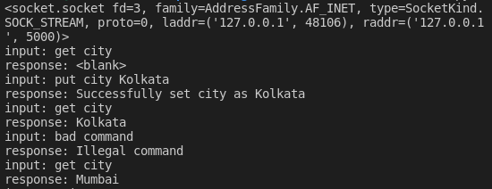

# Assignment 1

**Objective:** Implement a key-value store using socket programming.

**Name:** Rwitick Ghosh

**Class:** BCSE - III

**Group:** A1

**Date:** 20-01-2022

---

## Purpose

Implement a key-value store using socket programming. The server implements the key-value store and
clients make use of it. The server must accept clients’ connections and serve their requests for ‘get’ and ‘put’ key value pairs. All key-value pairs should be stored by the server only in memory. Keys and values are strings. The server should be running on a designated port no. The server should support multiple clients and maintain their key-value stores separately. Comment on the port nos used by the server and the clients. Implement authorization so that only a few clients having the role “manager” can access other’s key-value stores. A user is assigned the “guest” role by default. The server can upgrade a “guest” user to a “manager” user.

## Code Organization and Implementation

### Server

The `server.py` file contains the functions needed for accepting the client request and thereby generating a response. Each client is uniquely identified by its port number. When a client disconnects or connection times out, port number may be reused by another client. There can be 4 types of request by the client:

-   **get \<key\>**: Returns the value associated with the `key` or returns `<blank>`
-   **put \<key\> \<value\>**: Assigns the value `value` to the designated `key`
-   **auth \<username\> \<password\>**: Authenticates the client using the `username` and `password` pair. If the client is successfully authenicated, the client gets `manager` privileges and can use `manage` command
-   **manage \<portnumber\> \<command\> \<options\>**: This command is for authenticated users only, those who have successfully used `auth` at least once before. The `command` may be `get` or `put` and the options vary as per the command specified.

The server can accept multiple clients at the same time due to support via multi-threading approach. Each new client is served via a new Thread and the Thread stops either due to client disconnection or program termination.

### Client

The client is conatined in `client.py`. It contains only the basic functionality of reading the user input and sending it to the server.

### Configuration

The configuration is conatined in `config.py`. It contains the basic configuration details with the server's hostname, port numbers as well as the login details of the managers as a `key-value` pair.

## Code Snippets

### Authentication

```python
return (username in config["managers"] and
        base64.b64decode(config["managers"][username]) == password.encode())
```

### Multi threading

```python
client, address = self.sock.accept()
client.settimeout(self.timeOut)
t = threading.Thread(target=self.listenToClient, args=(client, address))
self.threads.append(t)
t.start()
```

### Sample Configuration

```python
config = {
    "serverHostName": "localhost",
    "serverPort": 5000,
    "timeOut": 60,
    "managers": {
        "adam": b'YmlsbA=='
    }
}
```

## Client Screenshots

### Client 1



### Client 2


<div class="page-break"></div>

## Server Screenshot


---

## Project BY

**Name:** Rwitick Ghosh

**Class:** BCSE - III

**Group:** A1
