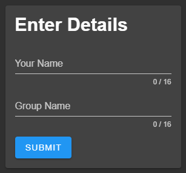
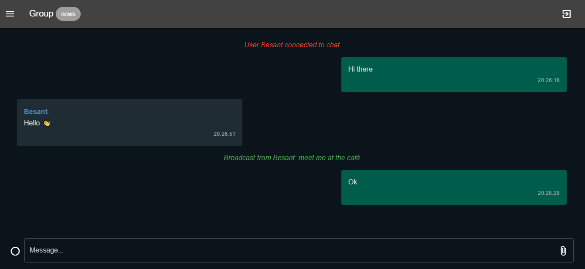
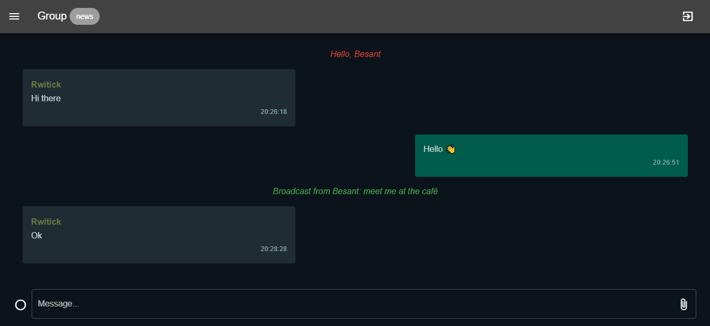
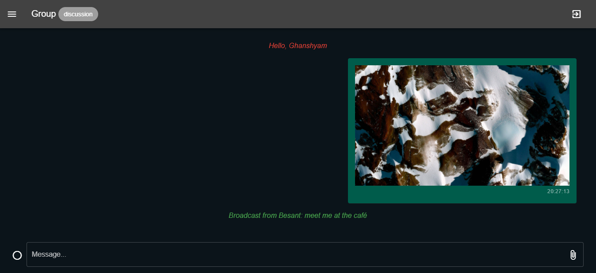
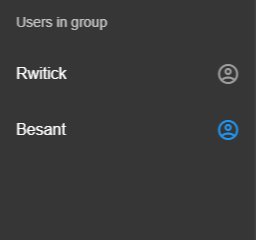
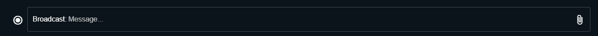
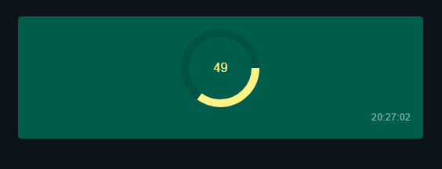

# Assignment 2

[View Report](Report.pdf)

**Objective:** Implement a multi client chat application.

**Name:** Rwitick Ghosh

**Class:** BCSE - III

**Group:** A1

**Date:** 15-02-2022

---

## Purpose

Write a multi-client chat application consisting of both client and server programs. In this chat application simultaneously several clients can communicate with each other. For this you need a single server (or multiple servers) program that clients connect to. The client programs send the chat text or image (input) to the server and then the server distributes that message (text or image) to all the other clients. Each client then displays the message sent to it by the server. The server should be able to handle several clients concurrently. It should work fine as clients come and go. Clients should be able to send messages in any **two** modes out of the following.

-   Unicast;
-   Multicast;
-   Broadcast;

Develop the application using a framework based on Node.JS.

## Web application frameworks

### Backend

Express.js

### Frontend

NuxtJS - based on Vue.js, Node.js, Webpack and Babel.js.

### Communication method

Websockets/HTTP long-polling implemented by Socket.IO. It is a JavaScript library for realtime web applications. It enables realtime, bi-directional communication between web clients and servers. It has two parts: a client-side library that runs in the browser, and a server-side library for Node.js. Both components have a nearly identical API.

<!-- ## Code Organization and Implementation

### Backend

### Client

## Code Snippets -->

## Client Screenshots

### Login Screen

    

### User Rwitick in Group "news"

### User Besant in Group "news"

### User Ghanshyam in Group "discussion"

### User list view in Group "news"

    

### Message type field

### Message type field with mode set to broadcast

### Progress of image upload

    

<!-- 

 -->

---

## Project BY

**Name:** Rwitick Ghosh

**Class:** BCSE - III

**Group:** A1
