# Assignment 4

**Objective:** Design an online apparel store.

**Name:** Rwitick Ghosh

**Class:** BCSE - III

**Group:** A1

**Date:** 22-04-2022

---

## Purpose

-   The store keeps records for its items in a database where some items may be discounted and some other items should be displayed as “new arrivals”.
-   A user may search for a specific item. By default, when a user signs in, based on his/her profile (male/female etc.), show him/her preferred set of clothing.
-   Users will be divided into two groups: some users looking for seasonal clothing items mainly, some others looking for new arrivals. So, depending on their preference already set in the database, their shopping experience would be different. Show the user products of the price range based on his/her purchase history.

Build this application using the **Spring framework**. You may apply the concept of session and cookies for tracking user behaviour.

## Prerequisties

-   Java 11
-   Maven
-   MongoDB server and the server connection string available as **MONGO_URI** environment variable
-   Spring Boot

## Software/Build Tools used

-   **Maven** for dependency management
-   Spring Boot Starters & Dependencies
    -   **spring-boot-starter-data-mongodb** package for Spring Data MongoDB
    -   **spring-boot-starter-security** package for Spring Security
    -   **spring-boot-starter-thymeleaf** package for Spring + Thymeleaf view integration
    -   **spring-boot-starter-web** package for Spring Web based functionalities
    -   **thymeleaf-extras-springsecurity5** package for evaluating namespace in spring security context
    -   **spring-boot-devtools** package for spring live reload
    -   **spring-boot-starter-test** package for unit testing spring application
    -   **spring-security-test** package for unit testing Spring Security
-   **SDKMan** for Java installation
-   **Bootstrap 5** directly from CDN for frontend CSS and JS

## Basic Overview of Controllers

The view is handled by the controllers corresponding to the functionality:

-   **AdminController:** Displays dashboard, add or delete items
-   **AuthController:** Displays the login/signup page, signs up a new user
-   **HomeController:** Displays the home page for non-logged in users & new arrivals or offers page based on preference for logged in user
-   **ItemController:** Displays the new arrivals, offers, orders page & processes buy order and shows result
-   **SearchController:** Displays the search page and search results

<div class="page-break"></div>

## Basic Overview of Services

The data processing and interface between the controller and data repositories is provided by the services.

-   **MongoUserDetailsService:** implements Spring Security's _UserDetailsService_, it is used by Spring Security via _loadUserByUsername(String)_ method to authenticate during login
-   **MongoUserService:** provides methods to check up user during sign-up at the controller using _registerNewUserAccount(User)_ which throws a custom _UserAlreadyExistsException_ to indicate that sign up cannot be allowed.
-   **OrderService** provides methods to add a new order for a user using _addNewOrder(String)_ which checks the validity and adds the order to data repository. It also provides _getAllOrders()_ method to retrieve a list of orders for an user.

## Database

### Domains

-   **Item** is the entity which has the values for an item such as name, price, whether new or on sale etc.
-   **User** is the entity which stores user details such as name, username, salted password, roles etc. It also stores a set of _UserRole_ objects so that it can be used by Spring Security.
    -   **UserRole** is an object that implements Spring Security's _GrantedAuthority_ using a _Role_ object and overrides _getAuthority()_ of the _GrantedAuthority_ interface.
    -   **Role** is an object which simply holds the name of the role such as _ROLE_ADMIN_ or _ROLE_USER_
-   **Order** is the entity which stores the id of the buyer (user), the id of the item, date of order and price at the time of order

### Data Repository

All the repository interfaces extends the _MongoRepository<Entity, Id>_ interface of Spring Data.

-   **ItemRepository** has methods
    -   _findSaleItems()_: to return items which are on sale
    -   _findNewItems()_: to return items which are new arrivals
    -   _findByNameBelowCost(String, int)_: to return list of items having the String in their names and below the price limit
-   **UserRepository** has method
    -   _findByUsername(String)_: to return the user with the username
-   **OrderRepository** has method
    -   _findOrderByBuyerId(String)_: to make an aggregation of _Order_ from the buyer with _Item_ and return the AggregationResults

## Code Snippets

### Register User

```java
public User registerNewUserAccount(User user) throws UserAlreadyExistsException {
    if (usernameExists(user.getUsername())) {
        throw new UserAlreadyExistsException(
                "There is already an account with the email address: " + user.getUsername());
    }
    user.setPassword(passwordEncoder.encode(user.getPassword()));
    user.addAuthorities(new UserRole().setRole(new Role().setName("ROLE_USER")));
    return userRepository.save(user);
}
```

### Spring Security Configuration

```java
protected void configure(HttpSecurity http) throws Exception {
    http
        .authorizeRequests()
        .antMatchers("/search").authenticated()
        .antMatchers("/buy/**", "/orders").hasRole("USER")
        .antMatchers("/dashboard", "/item/**").hasRole("ADMIN")
        .anyRequest().permitAll()
        .and()
        .formLogin().loginPage("/auth")
        .loginProcessingUrl("/login").permitAll()
        .and()
        .logout().permitAll()
        .and()
        .headers().httpStrictTransportSecurity()
        .includeSubDomains(true).maxAgeInSeconds(24 * 2 * 3600);
}
```

### Custom Authentication Provider

```java
@Bean
public AuthenticationManager customAuthenticationManager() throws Exception {
    return authenticationManager();
}
@Bean
public BCryptPasswordEncoder bCryptPasswordEncoder() {
    return new BCryptPasswordEncoder();
}
@Override
protected void configure(@Autowired AuthenticationManagerBuilder auth) throws Exception {
    auth.userDetailsService(userDetailsService)
            .passwordEncoder(bCryptPasswordEncoder());
}
```

### User Details Service

```java
@Service
public class MongoUserDetailsService implements UserDetailsService {
    @Autowired
    private UserRepository userRepository;
    @Override
    public UserDetails loadUserByUsername(String username) throws UsernameNotFoundException {
        com.barnacle.apparel.models.User user = userRepository.findByUsername(username);
        Set<GrantedAuthority> grantedAuthorities = new HashSet<>();
        if (user == null) throw new UsernameNotFoundException(username);
        user.getAuthorities().forEach(role -> {
            grantedAuthorities.add(
                new SimpleGrantedAuthority(role.getRole().getName()));
        });
        return new User(user.getUsername(), user.getPassword(), grantedAuthorities);
    }
}
```

### Add New Order

```java
public Optional<Item> addNewOrder(String itemId) {
    Optional<Item> oItem = itemRepository.findById(itemId);
    try {
        User u = (User) userService.getCurrAuthentication().getPrincipal();
        if (u != null && oItem.isPresent()) {
            com.barnacle.apparel.models.User user;
            user = userRepository.findByUsername(u.getUsername());
            Item item = oItem.get();
            if (user != null && !item.isDeleted()) {
                if (item.isNew())
                    user.incBuyNewCount();
                if (item.isSale())
                    user.incBuySaleCount();
                itemRepository.save(item.incrementBuyCount());
                userRepository.save(user);
                orderRepository.save(
                        new Order()
                                .setCost(item.getCost())
                                .setBuyerId(user.getId())
                                .setItemId(item.getId())
                                .setOrderOn(new Date()));
            }
        }
    } catch (Exception e) {
        e.printStackTrace();
    }
    return oItem;
}
```

### Find all orders for a user

```java
@Aggregation(pipeline = { "{$match: {buyerId: ObjectId(?0)}},",
        "{$unset: '_class'},",
        "{$lookup: {from: 'item',localField: 'itemId',foreignField: '_id',as: 'item'}},",
        "{$unwind: {path: '$item',preserveNullAndEmptyArrays: false}}]" })
AggregationResults<OrderItem> findOrderByBuyerId(String buyerId);
```

### Find items having the String in their names and below the price limit

```java
@Query("{'name': {$regex: new RegExp(?0, 'i')}, 'cost': {$lt: ?1}}")
List<Item> findByNameBelowCost(String pName, int below);
```

### Filter items by category

```java
@Query("{'isSale': true}")
List<Item> findSaleItems();
@Query("{'isNew': true}")
List<Item> findNewItems();
```

### Delete Item

```java
@GetMapping("/item/delete/{itemId}")
public String deleteItem(@PathVariable("itemId") String id, Model model, HttpServletResponse response) {
    String message = "Successfully Deleted", icon = "check-circle-fill", type = "success";
    try {
        Optional<Item> oItem = itemRepository.findById(id);
        if (oItem.isPresent()) {
            Item item = oItem.get();
            itemRepository.save(item.setDeleted(true));
        } else {
            response.setStatus(HttpServletResponse.SC_NOT_FOUND);
            message = "No such item with id " + id + " exists";
            icon = "exclamation-triangle-fill";
            type = "danger";
        }
    } catch (Exception e) {
        e.printStackTrace();
        response.setStatus(HttpServletResponse.SC_INTERNAL_SERVER_ERROR);
        message = "Server error";
        icon = "exclamation-triangle-fill";
        type = "danger";
    }
    return String.format("fragments/alert::alert(message='%s', icon='%s', type='%s')", message, icon, type);
}
```

### Home Page Redirection

```java
@GetMapping("")
public String index(Model model) {
    Object o = userService.getCurrAuthentication().getPrincipal();
    if (o.getClass() == User.class) {
        User u = (User) o;
        boolean isAdmin = u.getAuthorities()
                .stream().anyMatch(a -> "ROLE_ADMIN".equals(a.getAuthority()));
        if (isAdmin)
            return "redirect:/dashboard";
        com.barnacle.apparel.models.User user;
        user = userRepository.findByUsername(u.getUsername());
        if (user != null) {
            return user.getBuySaleCount() > user.getBuyNewCount()
                    ? "redirect:/current-sale"
                    : "redirect:/new-arrivals";
        }
    }
    return "index";
}
```

<div class="page-break"></div>

## Domain Models

### Item

```java
@Id
private String id;
@Indexed
private String name;
private Float cost;
private List<String> tags;
private boolean isNew;
private boolean isSale;
private String imageId;
private boolean isDeleted;
private int buyCount;
```

### User

```java
@Id
private String id;
private String name;
@Indexed(unique = true)
private String username;
private String password;
private Set<UserRole> userRoles;
private int buyNewCount;
private int buySaleCount;
```

### Order

```java
@Id
private String id;
@Indexed
@Field(targetType = FieldType.OBJECT_ID)
private String buyerId;
@Field(targetType = FieldType.OBJECT_ID)
private String itemId;
@CreatedDate
private Date orderOn;
private float cost;
```

## Result of Aggregation - OrderItem

```java
@Id
private String id;
private String buyerId;
private String itemId;
private Date orderOn;
private float cost;
private Item item;
```

## Part of pom.xml

```xml
<modelVersion>4.0.0</modelVersion>
<parent>
    <groupId>org.springframework.boot</groupId>
    <artifactId>spring-boot-starter-parent</artifactId>
    <version>2.6.6</version>
    <relativePath /> <!-- lookup parent from repository -->
</parent>
<packaging>jar</packaging>]
<properties>
    <java.version>11</java.version>
</properties>
<dependencies>
    <dependency>
        <groupId>org.springframework.boot</groupId>
        <artifactId>spring-boot-starter-data-mongodb</artifactId>
    </dependency>
    <dependency>
        <groupId>org.springframework.boot</groupId>
        <artifactId>spring-boot-starter-security</artifactId>
    </dependency>
    <dependency>
        <groupId>org.springframework.boot</groupId>
        <artifactId>spring-boot-starter-thymeleaf</artifactId>
    </dependency>
    <dependency>
        <groupId>org.springframework.boot</groupId>
        <artifactId>spring-boot-starter-web</artifactId>
    </dependency>
    <dependency>
        <groupId>org.thymeleaf.extras</groupId>
        <artifactId>thymeleaf-extras-springsecurity5</artifactId>
    </dependency>
    <dependency>
        <groupId>org.springframework.boot</groupId>
        <artifactId>spring-boot-devtools</artifactId>
        <scope>runtime</scope>
        <optional>true</optional>
    </dependency>
    <dependency>
        <groupId>org.springframework.boot</groupId>
        <artifactId>spring-boot-starter-test</artifactId>
        <scope>test</scope>
    </dependency>
    <dependency>
        <groupId>org.springframework.security</groupId>
        <artifactId>spring-security-test</artifactId>
        <scope>test</scope>
    </dependency>
</dependencies>
```

<div class="page-break"></div>

## Data Flow

### Dashboard

<div style="text-align: center">
    
</div>

### Orders

<div style="text-align: center">
    
</div>

### Buying an Item

<div style="text-align: center">
    
</div>

### Search

<div style="text-align: center">
    
</div>

### Home

<div style="text-align: center">
    
</div>

<div class="page-break"></div>

## View Templates

The view templates are rendered by Thymeleaf using default Thymeleaf Template Resolver Engine. The available templates are:

-   error:
    -   **403:** Custom 403 Forbidden page
    -   **404:** Custom 404 Not Found page
-   fragments:
    -   auth:
        -   **login:** login component fragment
        -   **register:** register component fragment
    -   item:
        -   **itemcard:** card of item component fragment
        -   **itemlist:** list of itemcard fragment
        -   **orderlist:** list of order component fragment
    -   nav:
        -   **navbar:** navigation bar with all navlinks component fragment
        -   **navlink:** navigation links component fragment
    -   **alert:** bootstrap alert component fragment
    -   **footer:** page footer with js component fragment
    -   **head:** page meta and css links component fragment
-   **arrivals:** for new arrivals
-   **auth:** for login/signup page
-   **dashboard:** for admin dashboard - add or remove items
-   **index:** for home page of non-logged in users
-   **itemsold:** for items sold when user buys
-   **order:** for list of orders for user
-   **sale:** for discounted items
-   **search:** for search items & results

## Static files

-   css:
    -   403.css
    -   404.css
    -   index.css
    -   login.css
-   js:
    -   addItems.js
    -   delItems.js **_(By adding it to footer for admin context, we can use it in all pages)_**
    -   preventSubmitIfInvalid.js
-   favicon.ico

## Application Properties configuration

```Properties
spring.data.mongodb.uri=${MONGO_URI}
spring.data.mongodb.auto-index-creation=true
logging.level.org.springframework.data.mongodb.core.MongoTemplate=DEBUG
```

<div class="page-break"></div>

## Client Screenshots

### -----> Home Page without login

<div style='text-align: center; border: 1px solid;'>
    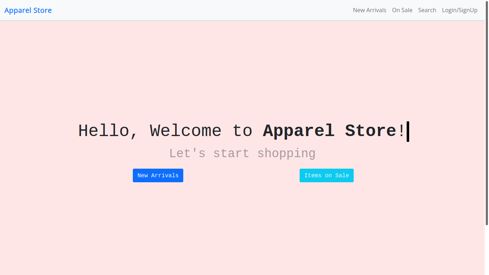
</div>

### -----> Login Page

<div style='text-align: center; border: 1px solid;'>
    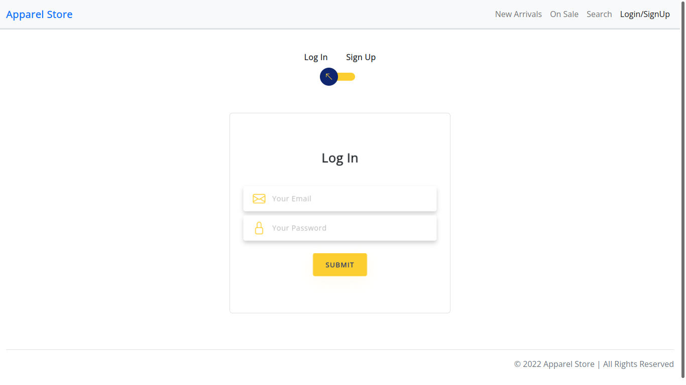
</div>
<div class="page-break"></div>

### -----> Sign Up page

<div style='text-align: center; border: 1px solid;'>
    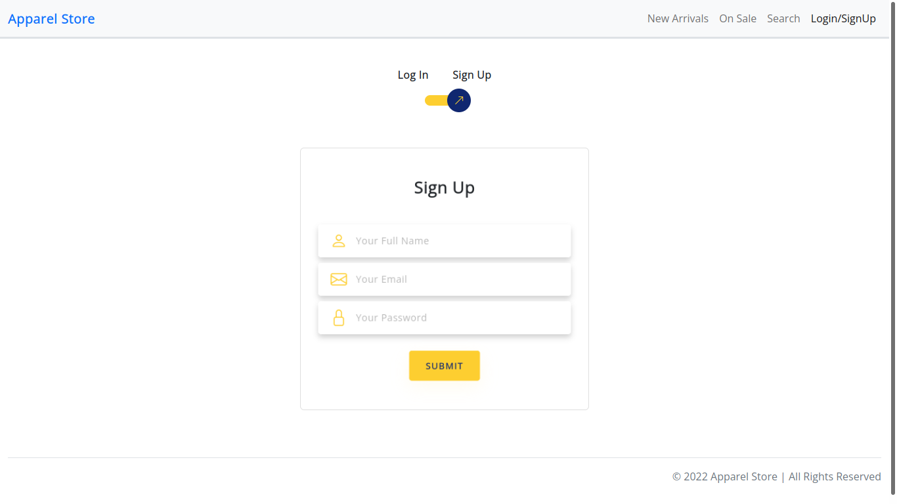
</div>

### -----> New Arrivals

<div style='text-align: center; border: 1px solid;'>
    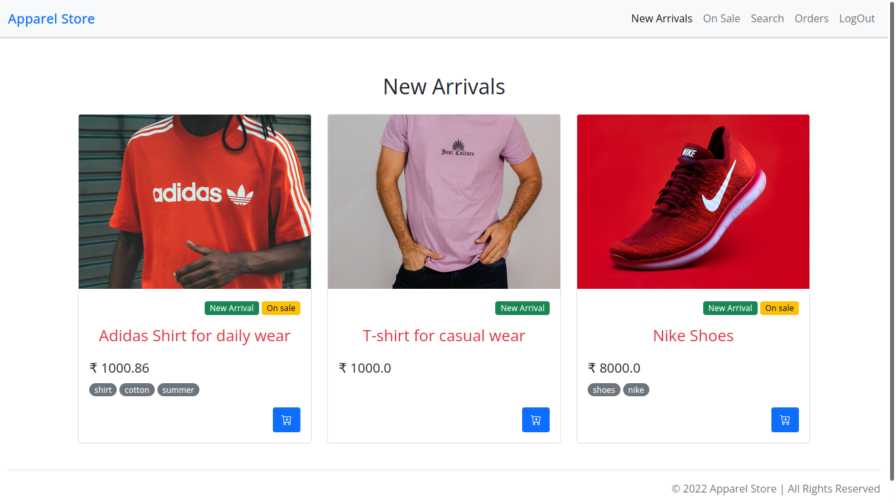
</div>
<div class="page-break"></div>

### -----> Discount Page

<div style='text-align: center; border: 1px solid;'>
    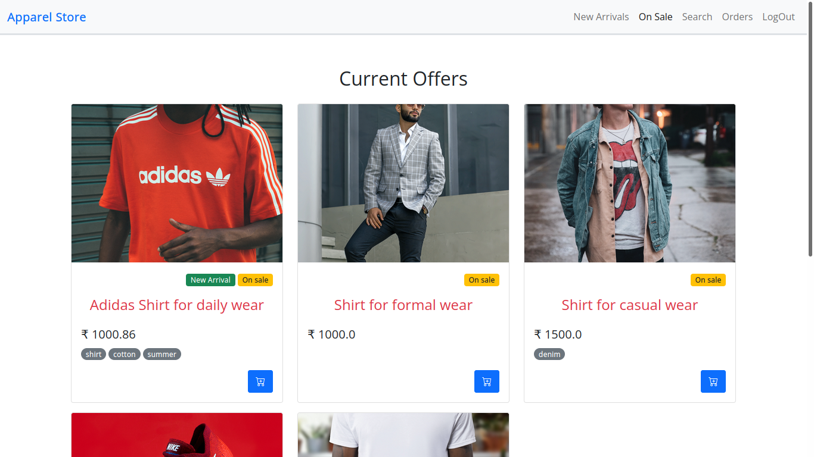
</div>

### -----> Search Page

<div style='text-align: center; border: 1px solid;'>
    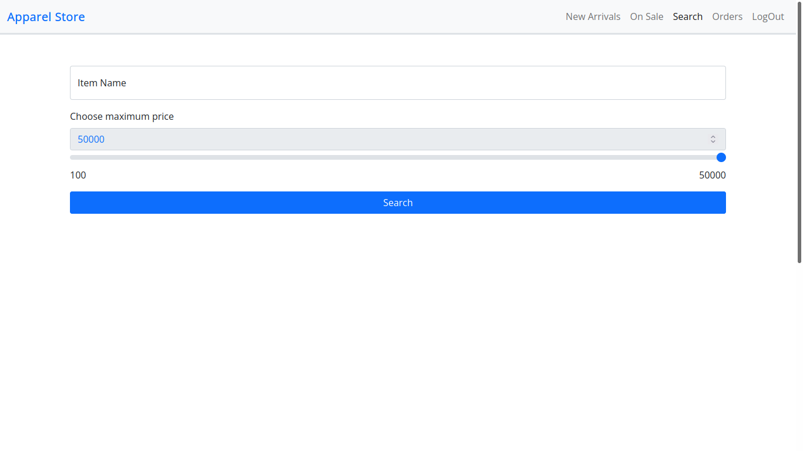
</div>
<div class="page-break"></div>

### -----> Search Results Page

<div style='text-align: center; border: 1px solid;'>
    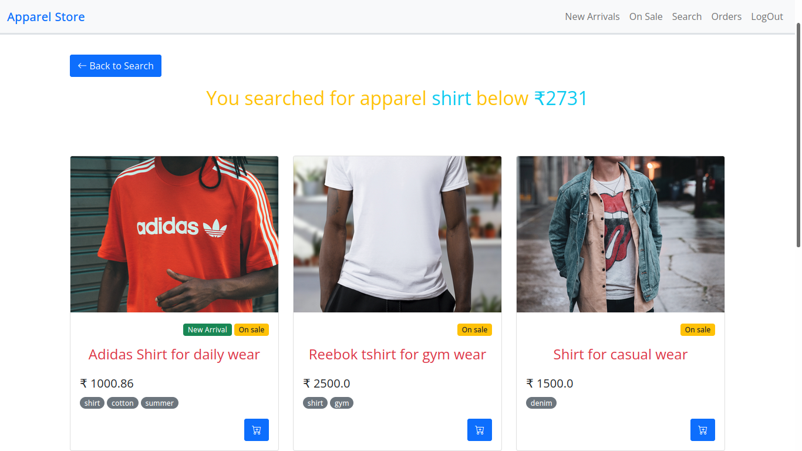
</div>

### -----> Item bought page

<div style='text-align: center; border: 1px solid;'>
    
</div>
<div class="page-break"></div>

### -----> Log Out page

<div style='text-align: center; border: 1px solid;'>
    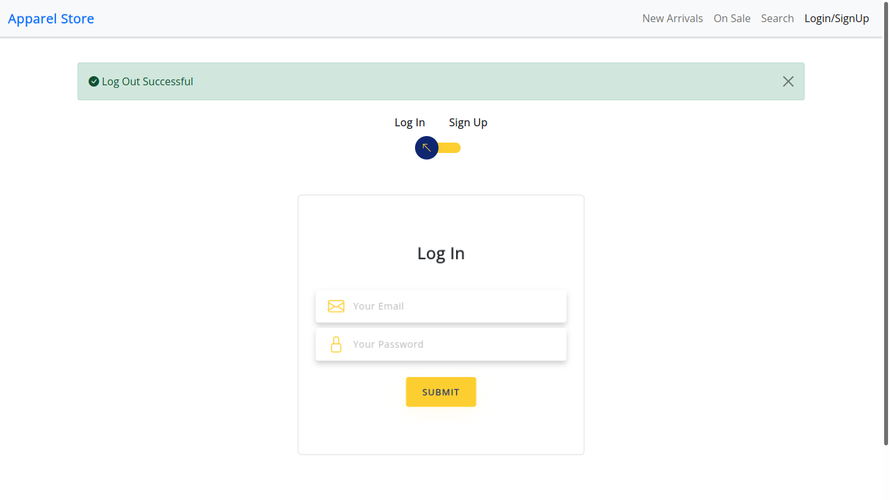
</div>

### -----> Invalid login attempt page

<div style='text-align: center; border: 1px solid;'>
    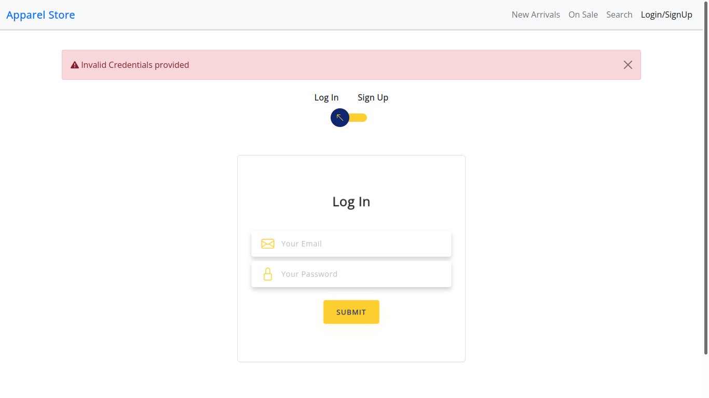
</div>
<div class="page-break"></div>

### -----> Inavlid Sign up attempt page

<div style='text-align: center; border: 1px solid;'>
    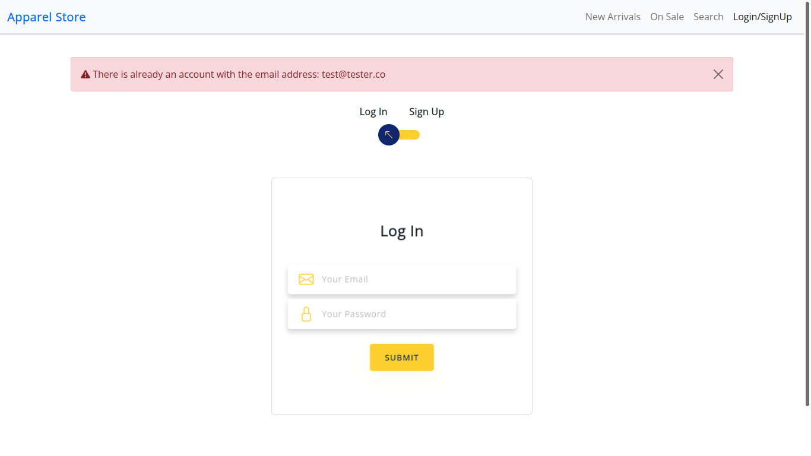
</div>

### -----> User orders page

<div style='text-align: center; border: 1px solid;'>
    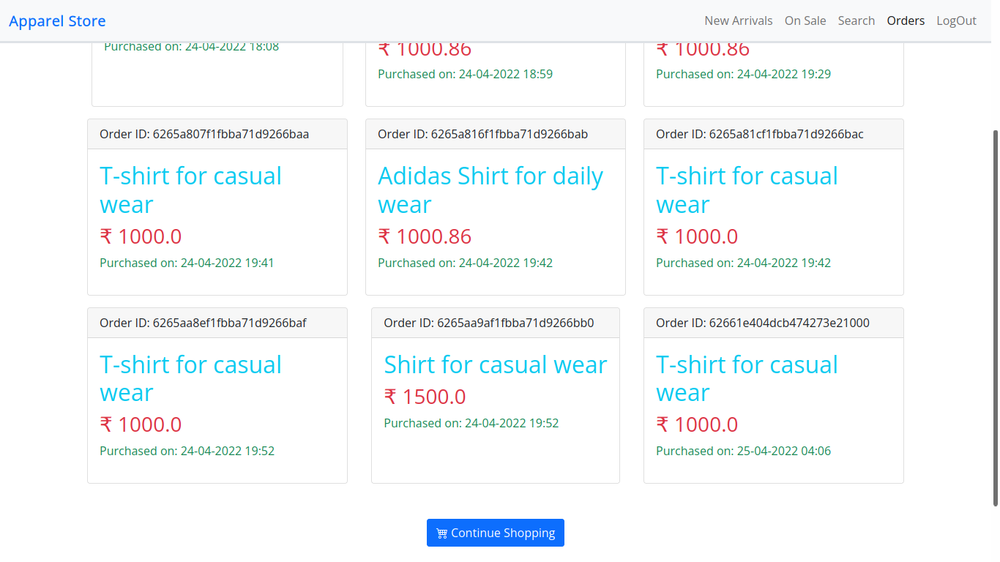
</div>
<div class="page-break"></div>

### -----> 403 Forbidden page

<div style='text-align: center; border: 1px solid;'>
    
</div>

### -----> 404 Not Found page

<div style='text-align: center; border: 1px solid;'>
    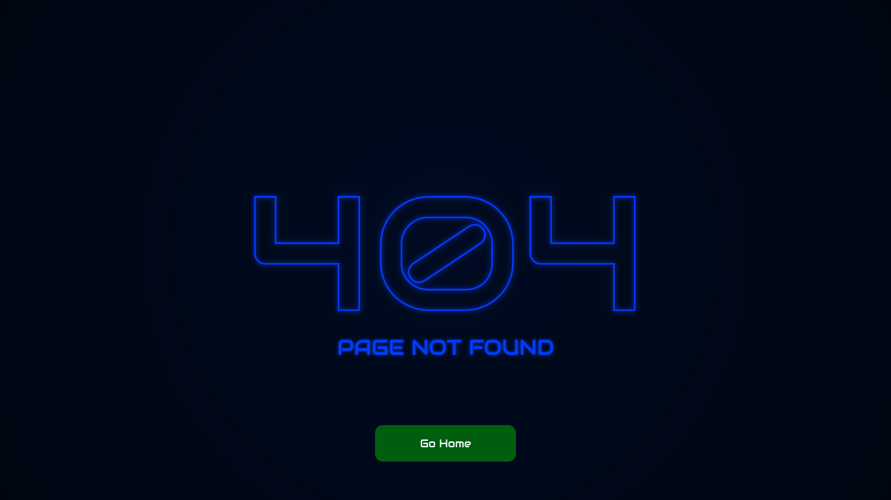
</div>
<div class="page-break"></div>

### -----> Admin Dashboard

<div style='text-align: center; border: 1px solid;'>
    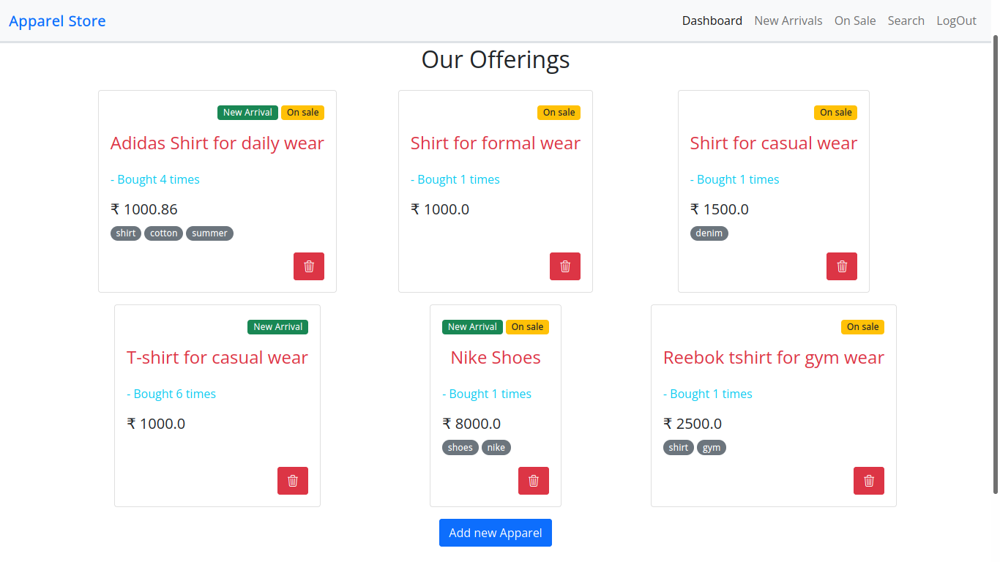
</div>

### -----> Admin delete item result

<div style='text-align: center; border: 1px solid;'>
    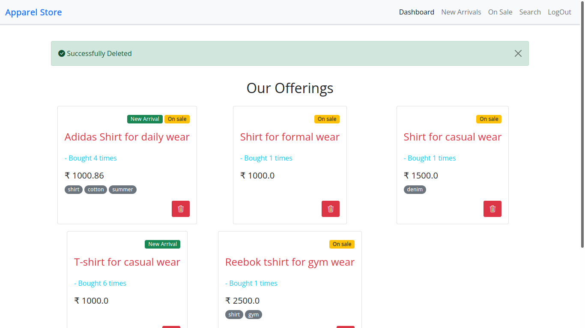
</div>
<div class="page-break"></div>

### -----> Admin add item modal

<div style='text-align: center; border: 1px solid;'>
    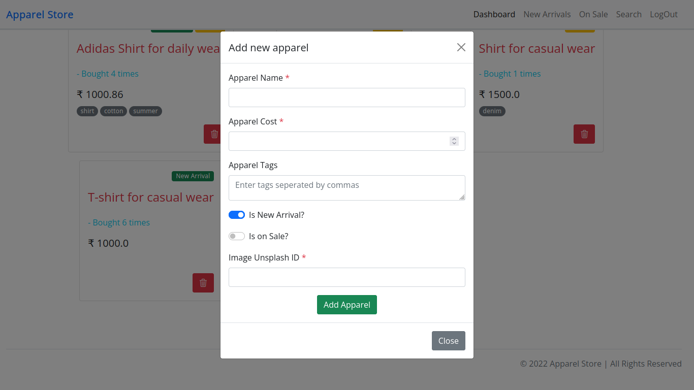
</div>

<br>
<br>
<br>
<br>
<br>

---

## Project BY

**Name:** Rwitick Ghosh

**Class:** BCSE - III

**Group:** A1
